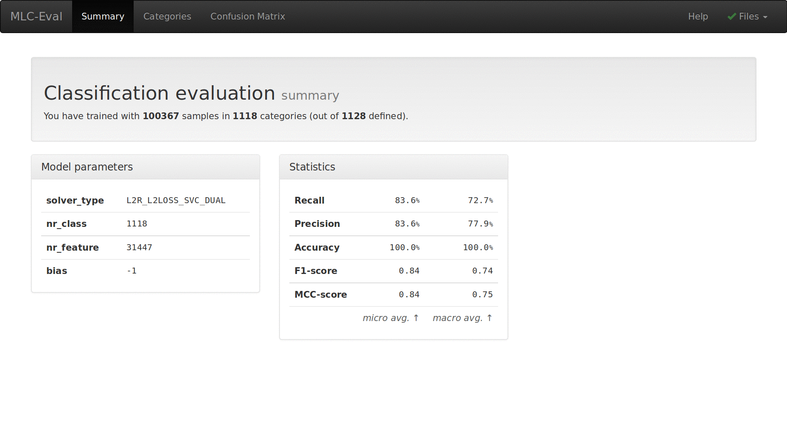

# MLC-Eval

**A user-interface for evaluation of classification results.**

When working with classification in machine learning, evaluation of results can be very
useful to check and improve. For larger datasets, existing tools remain limited.
This project provides a web-based user-interface for looking into classification results,
which should also work with thousands of classes.

The current focus is on [LIBSVM][] and [LIBLINEAR][], which provide a convenient way to work
with [support vector machines](https://en.wikipedia.org/wiki/Support_vector_machine) on
large datasets, but the approach should be applicable to other software and methods as well.


# Features

This project isn't fully complete in the sense that there's more useful information to
show. But it provides a starting point with a summary, category overview and [Confusion matrix][].



By default, the widely used iris dataset will be shown. It isn't a very good example, with
just three classes. To load your own dataset, put your own `data.cm` and other files in
`public/data/`, and add `?baseUrl=/data/data` to the url.


# Files

Classification data is read from the following files, currently served from `public/data/`:

- `data.cm` - confusion matrix
- `data.labels` - label names, to show class names instead of numbers _(optional)_
- `data.train` - training data file _(not yet used)_
- `data.tokens` - feature names, to show feature names instead of numbers _(not yet used)_
- `data.model` - the trained model, only the header is read to show properties _(optional)_

Only `data.train` and `data.model` are standard [LIBSVM][] files. A tool for generating the
confusion matrix is part of this project (see below), labels and tokens you'll need
to generate yourself. See example for file format.

## Generating a confusion matrix

A confusion matrix can be generated after doing cross-validation on the training data.
This can be done with the supplied scripts `libsvm-cm.rb` or `liblinear-cm.rb` (you'll need [Ruby][]).
Options are the same as for `svm-train` or `liblinear-train`.

```
$ gem install rb-libsvm
$ ruby libsvm-cm.rb public/example/data.train public/example/data.cm
```

or

```
$ gem install liblinear-ruby
$ ruby liblinear-cm.rb public/example/data.train public/example/data.cm
```

### File format

For reference, the confusion matrix file used here has the following format. Consider four
classes, `1`, `2`, `3` and `4`, with 6 training items each. Predictions are on the x-axis,
actual classes are on the y-axis. First line and first column are headers.
Sums for each line and column are at right and bottom.

    - 1 2 3 4 +
    1 5 0 0 1 6
    2 1 4 1 0 6
    3 0 0 4 2 6
    4 1 0 2 3 6
    + 7 4 7 6 24


# Roadmap

- include example data
- allow loading of remote urls
- allow browsing and loading of local files
- show item details in category overview
- add more metrics, also for each class

# [License](LICENSE.md)

[LIBSVM]: https://www.csie.ntu.edu.tw/~cjlin/libsvm/
[LIBLINEAR]: https://www.csie.ntu.edu.tw/~cjlin/liblinear/
[Confusion matrix]: https://en.wikipedia.org/wiki/Confusion_matrix
[Ruby]: http://www.ruby-lang.org/
